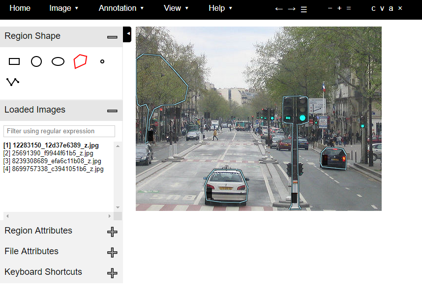
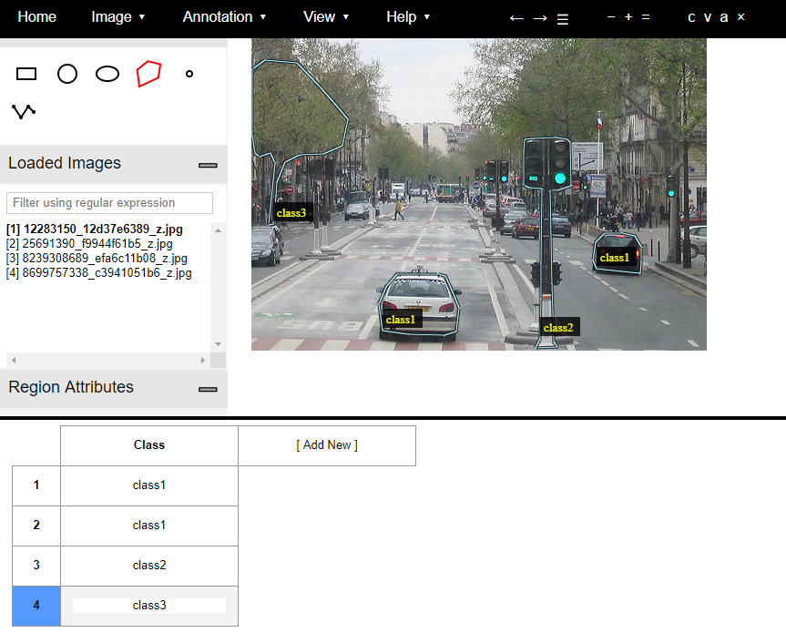
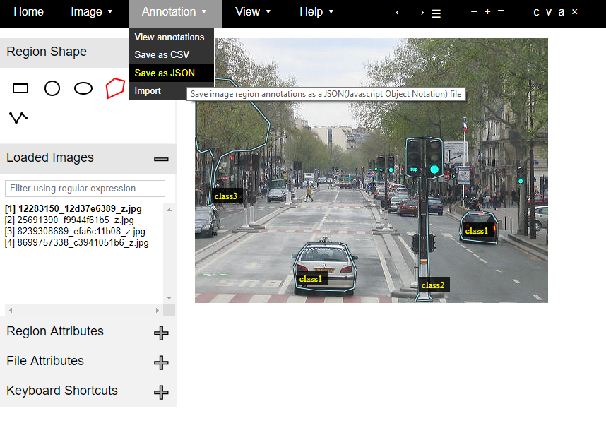

# Mask R-CNN python implementation for training and testing custom datasets
This implementation of [Mask R-CNN](https://arxiv.org/abs/1703.06870) on Python 3, Keras and Tensorflow is a simplified version of the [matterport Mask_RCNN](https://github.com/matterport/Mask_RCNN) implementation. This implementation allows the user to train and test on custom datasets, by following some basic and specific dataset structuring.

The [training](maskrcnntrain.py) and [testing](maskrcnninferrence.py) code has cues from the [matterport Mask R-CNN](https://github.com/matterport/Mask_RCNN) with some custom changes to allow easy structuring of dataset and the ability to train on custom multiclass datasets.

Please read through the following steps carefully to go about successfully training and testing Mask R-CNN on a custom annotated dataset.

# Step by Step guide to training a custom Mask R-CNN

To train on a custom dataset without making any changes to the code, implement the following steps as it is.

## 1. Dividing the dataset into training and validation set

* Put the training set in this [folder](TrainingImages/train)
* Put the validation set in this [folder](TrainingImages/val)

## 2. Annotating the dataset

* For annotating the dataset, we use [via 1.0.6](http://www.robots.ox.ac.uk/~vgg/software/via/) - download the tool using this [link](http://www.robots.ox.ac.uk/~vgg/software/via/downloads/via-1.0.6.zip)
* Load the images from the [training set folder](TrainingImages/train) onto the tool and select the polygon tool to mark regions for annotation

* After marking regions of different classes on the images, select the Region Attributes tab and create a column with the name as Class and give a class-name of your choice to each object in the column

* Once region annotations have been made for all the images, download the annotation in form of a JSON file and name the file 'RegionJson.json'

* Save the 'RegionJson.json' into the [training set folder](TrainingImages/train).
* Repeat the above procedure for the validation set and save its 'RegionJson.json' into the [validation set folder](TrainingImages/val).
